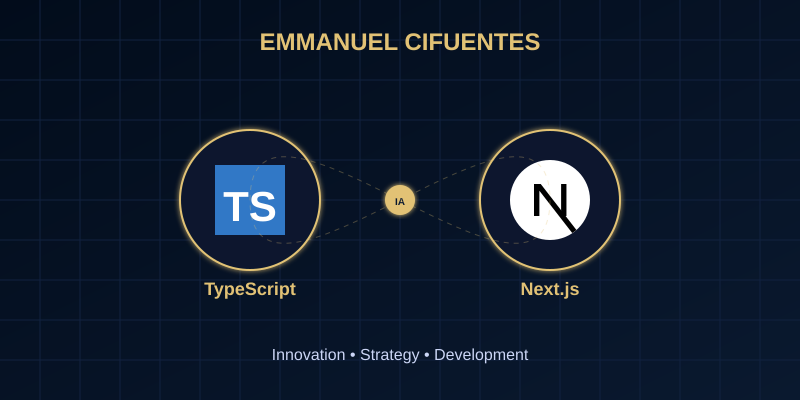

# Hola, soy Emmanuel Cifuentes

  

### Junior Fullstack Developer | Innovación & Estrategia de Mercado

Soy un desarrollador de 17 años (nacido el 7 de septiembre de 2008) apasionado por la **innovación constante**. Mi enfoque va más allá del código: busco **comprender el mercado** para identificar el "gancho" perfecto que conecte con el público y genere impacto real.

---

## Mi Stack Tecnológico

He desarrollado habilidades sólidas en las tecnologías más demandadas del mercado para construir soluciones robustas y escalables:

| Frontend | Backend & Core | Tools & DB |
| :--- | :--- | :--- |
|  |  | |
|  |  |  |
|  |  |  |
|  | | |

---

## Proyectos Destacados

Actualmente desarrollo múltiples proyectos dentro de **Riwi**, donde aplico metodologías ágiles y pensamiento de producto:

- **Proyecto Integrador de Ruta Básica:** Una solución integral que demuestra el dominio de las bases del desarrollo web y la lógica de programación.
- **Innovación en Riwi:** Diversos proyectos enfocados en optimizar procesos y mejorar la experiencia del usuario.

---

## Estadísticas de GitHub

  
  

---

## ¡Hablemos!

¿Tienes alguna idea innovadora o buscas un desarrollador comprometido con el éxito del producto? ¡Contáctame!

- **Correo:** [cifuentesalfonso367@gmail.com](mailto:cifuentesalfonso367@gmail.com)
- **Teléfono:** [+57 313 6932945](https://wa.me/573136932945)

---

  Desarrollado por Emmanuel Cifuentes. La innovación no se detiene.

